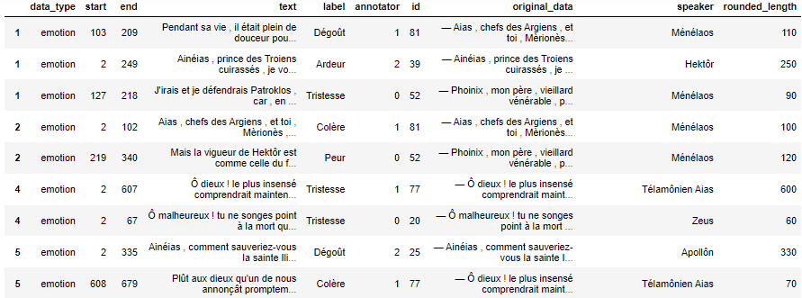
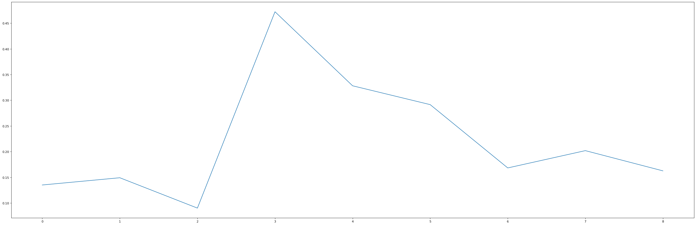
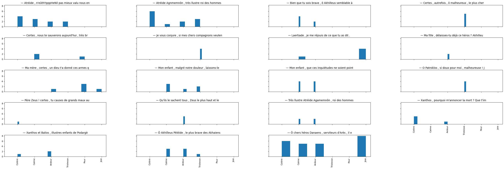
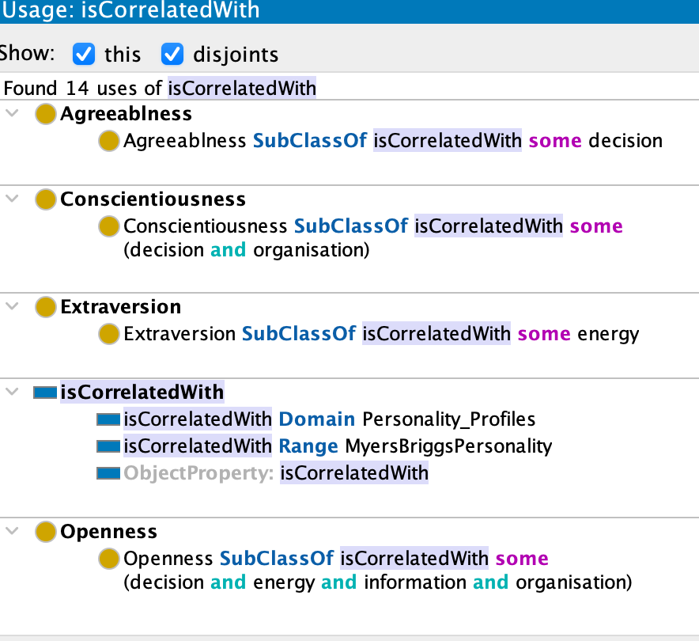
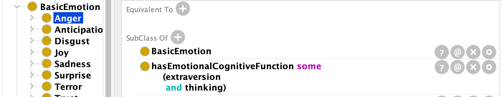
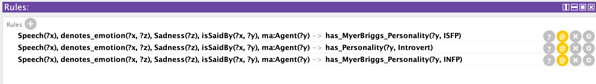

---
numbersections: true
title: La personnalité des personnages de l'Iliade à l'aide d'une ontologie des émotions
author: Loïc Aubrays, Gislain Delavy, Marcela Hitrackova
date: 31 mai 2022
tags: [web sémantique, émotion, Myer-Briggs Type Indicator, ontologie]
abstract: |
    A l'aide d'extraits de l'Iliade annotés avec des émotions, le but est de déterminer le rôle narratif des personnages en dressant un profil psychologique par l'utilisation des technologies du web sémantique. S'appuyant sur différents travaux, la méthode semble prometteuse, mais le projet s'est trouvé limité dans sa réalisation par la diversité du dataset et par la redéfinition de la portée de l'ontologie.
...
---
<!-- # Plan

1. Introduction = but et méthodes
2. Collecte et préparation des données
3. Quelques éléments statistiques (IAA, etc.)
4. La problématique des mots d'une phrase
5. Psychoprofil des personnages
6. Utilisation des données dans l'ontologie
7. Conclusion -->

# Introduction

Dans le contexte de notre travail final de Web sémantique nous avons travaillé autour du sujet de la représentation des profils psychologiques des personnages d'Iliade d'Homère. L'Iliade est loin d'une fiction typique. Il s'agit d'un mélange de poésie, de fiction et de descriptions historiques.

L'épopée se déroule pendant la guerre de Troie et détaille les événements survenus pendant quelques semaines de la dixième et dernière année de la guerre.[^1]

Une caractéristique étonnamment intéressante de l'Iliade est le grand nombre de personnages représentés, des humains et des divinités. Il faut ainsi compter environ 750 personnages dont environ 49 personnages principaux. L'Iliade a attribués à ces personnages des caractéristiques détaillées, ce qui donne une vision approfondie de la personnalité « archétypale » dans les anciennes histoires.

[^1]: https://fr.wikipedia.org/wiki/Iliade

# Collectes et préparation des données

## Récolte des données

Les données utilisées dans le cadre de ce travail ont été collectées par les étudiants du cours « Bases de données » de l’université de Lausanne, en automne 2021. A chaque étudiant était assigné un chapitre de la traduction française de l’Iliade d’Homère. Chaque chapitre a été annoté par 4 étudiants, chacun travaillant individuellement. Pour ce faire, les étudiants ont utilisé le logiciel LabelStudio afin de parcourir chaque paragraphe de leur chapitre.

Pour chaque paragraphe, les étudiants avaient pour but d’identifier les 3 caractéristiques suivantes :

   - L’orateur (*Speaker*)
   - Le ou les émotions exprimées dans le paragraphe (*Emotion*)
   - La partie du paragraphe dans laquelle chaque émotion apparaissait (*Speech*)

Les étudiants disposaient de 8 émotions différentes pour annoter leurs paragraphes : Ardeur, Calme, Joie, Plaisir, Dégoût, Tristesse, Colère, et Peur. Une fois que l’entièreté du chapitre était annotée, les étudiants étaient invités à convertir leur travail au format JSON.

Pour résultat final, ce fichier JSON contient une entrée par paragraphe, détaillant les émotions que l’annotateur a repérées, ainsi qu’une entrée liée à cette dernière identifiant l’orateur de ce paragraphe. Ces deux entrées sont liées par un identifiant commun.

## Erreurs durant la récolte de données

Bien que la plupart des données ont été correctement récupérées, certaines erreurs ont toutefois rendu leur utilisation plus complexe que prévu.

Certains annotateurs, dans l’espoir de gagner du temps, ont omis de créer une entrée « Speaker » par paragraphe, préférant à la place en créer une seule et de la lier à de multiples paragraphes. Les entrées « Speaker » avaient donc, au lieu d’un identifiant unique, une plage de chiffre, par exemple, [37-41], ou encore [37, 38, 40, 45, 49]. Ceci s’est avéré particulièrement laborieux à déchiffrer au travers de code Python. La modification de fichiers JSON étant difficile sans le logiciel originel, ces entrées ont été manuellement modifiées pour transformer les plages en un chiffre unique, par exemple, [37-41] devenant [37].

Dans d’autres cas, les fichiers de certains annotateurs étaient enregistrés au format CSV, leur utilisation aurait nécessité une approche différente des fichiers JSON et donc doublé le travail requis. Un autre cas commun est que certains annotateurs ont entièrement omis certains paragraphes, créant des incohérences dans leurs fichiers.

Pour ces nombreuses raisons, il est important de souligner que les données utilisées dans le cadre de ce projet ne sont pas parfaites, et qu’il est donc normal de s’attendre à des incohérences légères dans les résultats obtenus. Toutefois, le fait que chaque chapitre était assigné à de multiples étudiants devrait avoir en partie limité ces problèmes.

## Traitement des données

Afin de traiter ces données, nous avons converti chaque fichier JSON en un DataFrame à l’aide de la libraire Python `pandas`. Une fois cette courte étape terminée, les fichiers JSON produits par LabelStudio étant riches en information, la première partie du traitement des données consistait à ne garder que les données nécessaires à ce projet :

  - `Data_type` : Emotions, Speaker ou Speech
  - `Start` : Premier caractère du speech
  - `End` : Dernier caractère du speech
  - `Text` : La phrase en question
  - `Label` : L’émotion représentée dans la phrase
  - `Annotator` : Représenté par un chiffre
  - `ID` : Le lien entre une entrée Speech et Speaker
  - `Original_Data` : Le paragraphe d’où provient la phrase.
  - `Speaker` : La personne énonçant la phrase en question
  
Il est important de noter que toutes ces informations ne sont pas disponibles dans chaque entrée. Les entrées de type « Speaker », par exemple, ne contiennent pas de colonne `Text`, ou `Label`. De manière similaire, les entrées « Emotions » et « Speech » ne contiennent pas de `Speaker`. Une fois toutes les données inutiles retirées, il faut donc les joindre. Pour ce faire, Pandas offre la fonction `merge()`, permettant de relier deux entrées ayant une colonne en commun. Dans notre cas, cette colonne est nommée `ID`.

Une fois cette étape terminée, nous nous retrouvons avec un DataFrame contenant toutes les données présentées ci-dessus. Il est alors très simple de répéter le procédé pour tous les fichiers JSON d’un chapitre, et d’ensuite les concaténer en un seul grand DataFrame. Une fois cela fait, les entrées sont groupées par paragraphe, afin de plus facilement observer la façon dont chaque annotateur a annoté chaque paragraphe.

{#fig:dataframe}

# Quelques éléments statistiques

## Agrément Inter-Annotateur

Nous avons commencé par calculer le pourcentage d’agrément inter-annotateur en prenant en compte l’émotion attribuée à chaque phrase. L’alpha de Krippendorff de chaque chapitre révèle des valeurs comprises entre 0.09 et 0.47, pour une moyenne de 0.233. Cette valeur est cohérente lorsque comparée avec celle obtenue par J.Pavlopoulos, A.Xenos et D.Picca dans leur étude « Annotating the Sentiment of Homeric Text)[^annot-sentiment-homeric], qui se basait sur le ressenti de la phrase (Positif, Négatif, Neutre). En effet, leur recherche a trouvé une valeur alpha de 0.39, mais les possibilités offertes aux annotateurs étaient moindres (3 ressentis contre 8 émotions). Il est donc logique de retrouver plus de désaccord entre participants.

[^annot-sentiment-homeric]: Pavlopoulos J. Xenos A. Picca D. “Annotating the Sentiment of Homeric Text”. Athens University of Economics and Business, Greece. University of Lausanne, Switzerland.

{#fig:KP_alpha}

## Histogrammes

Une visualisation en histogramme des différents paragraphes présents dans un chapitre permet de surligner les nombreux désagréments entre les annotateurs. En effet, il n’est pas rare de retrouver 4 émotions ou plus annotées dans un seul paragraphe, ce qui met en évidence le désaccord entre les différents annotateurs.

En revanche, nous pouvons aussi voir que certains paragraphes font l’unanimité, avec une seule émotion représentée dans l’entièreté du paragraphe. Nous pouvons donc en conclure que certains paragraphes contiennent des émotions très nuancées, tandis que d’autres sont bien plus simples à interpréter.

{#fig:hist_19}


# Des mots à identifier aux extraits déjà annotés  

L'ontologie de départ prévoyait de mettre en relation un mot avec une émotion par l'intermédiaire du sens du mot. Ainsi il existe une sous-classe de mot *Word^C^*[^legend] pour chaque émotion, par exemple pour la joie avec *Joy_Words^C^*. En s'appuyant sur la définition de *Lexical Entry^C^* tiré l'ontologie Ontolex-Lemon, nous pourrions ainsi donner du sens aux mots via le *Lexical Concept^C^* et les ontologies existantes, tel BabelNet ou WordNets.

Mais cela ne correspond pas à nos données. En effet, celles-ci sont constituées d'une ou plusieurs phrases où l'émotion a déjà été attribuée par un ou plusieurs annotateurs.

Nous avons alors opté pour utiliser l'ontologie NLP Interchange Format (NIF) qui permet l'usage de morceaux de textes et qui est utilisé pour l'annotation de corpus. Nos extraits annotés *Speech^C^* ont alors été déclarés comme équivalents à la classe *nif:String^C^* de NIF. Au sein de cette classe, nous pouvons stocker le morceau de texte, grâce à *nif:isString^dp^* liée à la sous-classe *Context^C^*. Il est alors possible de noter le début et la fin de chaque extrait afin de pouvoir ensuite obtenir la position de chaque mot en fonction de l'extrait.

Nous avons découvert tardivement que NIF propose de gérer les annotations via la propriété d'objet *nif:PropertyAssertionAnnotation^op^* et la classe *nif:EntityMention^C^*. Dans un prolongement de ce travail, il semblerait pertinent d'explorer ces aspects pour traiter correctement les annotations.[^nif-corpus]

Dans cet esprit, nous avons déjà aligné la classe *Word^C^* avec les classes *nif:Word^C^* et *ontolex:Word^C^*, liant ainsi les mots porteurs d'émotion avec leur présence dans le texte sous forme lexicale.

[^legend]: L'exposant ^C^ correspond à *class*, ^op^ à *object property*, ^dp^ à *data property*, ^ap^ à *annotation property* et ^i^ à *individual*.
[^nif-corpus]: Et plus particulièrement ces bonnes pratiques : https://bpmlod.github.io/report/nif-corpus/index.html

# Modélisation de psycho-profil de personnage d'Iliade

Comme discuté plus haut, nous avons travaillé sur la base d’une ontologie qui comportait déjà d'autres ontologies alignées ainsi que diverses classes.
On y trouvait surtout la classe du personnage (ma:Agent), les classes des émotions (Emotion avec les sous-classes Basic et Complex), les classes de traits de personnalité NEO-PI Personality_Profile (connues sous le nom "Big 5" avec les sous-classes : Agreeableness, Conscientiousness, Extraversion, Openess et Neuroticism) ainsi que les rôles narratifs (Hero, AntiHero, Vilain).

L'ontologie de base utilise le NEO-PI typologie de personnalité, le modèle de trait psychologique mondialement reconnu et utilisé par de nombreux chercheurs. [^2] Dans l'ontologie de base cette typologie permet ensuite de construire les rôles narratifs des personnages.

[^2]: Roccas, Sonia; Sagiv, Lilach; Schwartz, Shalom H.; Knafo, Ariel (2002). ["The Big Five Personality Factors and Personal Values"](https://journals.sagepub.com/doi/abs/10.1177/0146167202289008). _Personality and Social Psychology Bulletin_. **28** (6): 789–801. [doi](https://en.wikipedia.org/wiki/Doi_(identifier) "Doi (identifier)"):[10.1177/0146167202289008](https://doi.org/10.1177%2F0146167202289008). [S2CID](https://en.wikipedia.org/wiki/S2CID_(identifier) "S2CID (identifier)") [144611052](https://api.semanticscholar.org/CorpusID:144611052).

Nous avons souhaité travailler sur cette base et apporter un autre aspect pour décrire les traits de personnalité d'un personnage littéraire. C'est pourquoi nous avons choisi de modéliser le profil Myers-Briggs qui est très connu, mais peu utilisé dans les recherches scientifiques.

Le Myers Briggs Type Indicator (MBTI) est un outil d'évaluation psychologique déterminant le type psychologique d'un sujet parmi seize types différents, suivant une méthode proposée en 1962 par Isabel Briggs Myers et Katherine Cook Briggs. [^3] Il a été créé sur la base de théorie de Carl Gustav Jung qui a décrit quatre fonctions psychologiques de base :

  -   Extraversion vs. introversion.
  -   Sensation vs. intuition.
  -   Thinking vs. feeling.
  -   Judging vs. perceiving.

[^3]: https://fr.wikipedia.org/wiki/Myers_Briggs_Type_Indicator

Le modèle MBTI combine ces fonctions et ainsi les seize types psychologiques de base se sont développés, décrivant les traits psychologiques suivant :

D'où tire-t-on son énergie : Extraversion (E) ou Introversion (I)
Comment perçoit-on les choses : Sensation (S) ou INtuition (N)
Comment prend-on ses décisions : Pensée (T) ou Sentiment (F)
Comment aborde-t-on le monde : Jugement (J) ou Perception (P)[^4]

[^4]: d'après [Le MBTI – Indicateur de types psychologiques Myers-Briggs](http://www.orientaction.ca/index.php?option=com_content&view=article&id=51&catid=37&Itemid=79) [[archive](https://archive.wikiwix.com/cache/?url=http%3A%2F%2Fwww.orientaction.ca%2Findex.php%3Foption%3Dcom_content%26view%3Darticle%26id%3D51%26catid%3D37%26Itemid%3D79 "archive sur Wikiwix")], Wilfrid Larochelle, c.o.

L'indicateur MBTI identifie alors 16 grands types de personnalité à partir des deux préférences possibles sur chacune des quatre dimensions.

Pour construire notre ontologie nous avons donc besoin de modéliser la liaison entre les cinq classes suivantes :

Les phrases (Speech) - les émotions (Emotion) - NEO-PI (Personality-Profile) - MBTI (MyersBriggsPersonality) - les rôles narratifs (Narrative Role).

## Relation entre MBTI et NEO-PI

Pour pouvoir construire notre ontologie et modéliser les relations, nous avons commencé par étudier les liaisons entre MBTI, NEO-PI et les rôles narratifs. Très rapidement, nous nous sommes heurtés au manque de littérature scientifique utilisant la typologie Myers-Briggs. Nous nous sommes alors appuyés sur de recherches plutôt anciennes. Celles-ci nous ont donnés quelques pistes pour construire ce modèle, mais malheureusement par manque d'expertise en psychologie nous ne pouvons pas exprimer plus subtilement les relations entre ces éléments. 

Le principal problème dans l'utilisation de MBTI est que cette typologie ne prend pas en compte certains aspects primordiaux de la personnalité comme par exemple, "Neurotisicm". De ce fait, il est impossible d'exprimer les traits de personnalité "négatifs" qui décriraient par exemple un "Vilain". On ne peut ainsi créer une liaison directe entre les caractéristiques de MBTI et les Rôles Narratifs. Nous avons donc dû chercher d’autres moyens de relier la typologie MBTI et les NarrativeRole.

Par conséquent, nous avons utilisé un autre travail de recherche qui établit une certaine corrélation entre NEO-PI et MBTI [^5]. Cette recherche nous permet de créer une relation entre la classe *"PersonalityProfile"* et la classe "*MyersBriggsPersonality*" grâce à la propriété d'objet *"isCorrelatedWith"*.

[^5]: Furnham - 1996 - The big five versus the big four the relationship.pdf

En résumé, cette recherche met en relation MBTI et NEO-PI de la façon suivante :

| NEO-PI | correlation | MBTI |
|---|---|---|
| Agreeableness |  | thinking-feeling (T-F) |
| Conscientiousness |  | thinking-feeling (T-F)<br>judging-perceiving (J-P) |
| Extraversion |  | extraversion-introversion (E-I) |
| Neuroticism |  |  |
| Openness |  | extraversion-introversion (E-I) <br>thinking-feeling (T-F)<br>judging-perceiving (J-P)<br>sensing-intuitive(S-N)<br> |
{#tbl:neo-pi-mbti}

Grâce à cette liaison nous pouvons exprimer les rôles narratifs par les traits de personnalité Myers Briggs.

{#fig:isCorrelatedWith}

## Les relations entre les Emotions et MBTI

Pour produire un modèle de traits de caractère de personnage d'Iliade, nous avons également besoin de construire une relation entre la classe Emotion et le profil MBTI.

Dans la littérature scientifique, il existe une liaison directe que nous pouvons utiliser dans notre ontologie. Cette recherche se base sur les recherches de Robert Plutchik et montre le lien entre les émotions de bases et les fonctions cognitives MBTI. [^6] Les relations sont exprimées de manière suivante :

[^6]: Drews, Markus. (2007). “Robert Plutchik’s Psychoevolutionary Theory of Basic Emotions.” University of Applied Sciences Postdam, Germany.

| EMOTIONS |  | FONCTIONS COGNITIVES |
|---|---|---|
| Fear | <=> | Introverted Thinking |
| Anticipation | <=> | Introverted Intuition |
| Sadness | <=> | Introverted Feeling |
| Disgust | <=> | Introverted Sensing |
| Anger | <=> | Extroverted Thinking |
| Surprise | <=> | Extroverted Intuition |
| Joy | <=> | Extroverted Feeling |
| Trust | <=> | Extroverted Sensing |
: Liaison entre les émotions et les fonctions cognitives {#tbl:emotion-cognition}

Nous avons exprimé cette relation directement comme une sous-classe qui réunit ces deux aspects de personnalité par une propriété d'objet "hasEmotionalCognitiveFunction". 

{#fig:anger-cognition}

Le dernier aspect que nous avons souhaité rajouter dans l'ontologie exprime une relation directe entre l'émotion et le MBTI. Nous nous sommes appuyés à nouveau sur les recherches de Robert Plutchik's Psychoevolutionary Theory of Basic Emotions qui ont été interprétées par Steven Hudaks de façon suivante :

![Les 16 combinaisons de rôles observées ainsi que leur type Myers-Briggs correspondant. Les flèches indiquent le flux naturel de la pensée, et les émotions dominantes conscientes sont en gras et commencent par une lettre majuscule[^7]](images/emotion-MBTI.png){#fig:emotion-mbti}


Ainsi nous avons pu construire les Rules qui expriment les relations entre les émotions de bases et les personnalités NEO-PI ou MBTI. 

{#fig:rules-swrl}

# Utilisation des données dans l'ontologie

Pour nourrir l'ontologie avec les données annotées, nous avons choisi d'utiliser la librairie `Owlready2`. Plusieurs difficultés se sont alors fait jour.

La première concerne l'incompatibilité du format Turtle avec la librairie. Nous avons donc changé le format de notre ontologie pour la syntaxe RDF/XML, mais ce fut plus compliqué pour l'ontologie NIF, qui utilise aussi le format Turtle. Il a été nécessaire de modifier le fichier de l'ontologie en dehors de Protege pour spécifier le chemin d'importation de la ressource grâce à la balise suivante :

```
<owl:imports
    rdf:resource="http://persistence.uni-leipzig.org/nlp2rdf/
        ontologies/nif-core/nif-core.owl" />
```

La seconde révéla un problème de gestion de projet. En effet, nous tentons enfin, à quelques heures de la fin du projet, d'effectuer un test manuel avant d'écrire le code d'importation. Nous ajoutons alors un « speaker-test » et un « speech-test ». Et là, ça ne fonctionne pas comme espéré. Nous réalisons progressivement que les différents changements dans la portée de l'ontologie ont créé des incohérences et vont même jusqu'à causer des erreurs et des crashs du plugin SWRLTab de Protege.

Nous corrigeons donc l'ontologie et les règles SWRL pour arriver aux éléments que nous avons déjà présentés. Alors pourquoi en parler ? Car cela a fortement impacté la fin du projet. En effet, nous n'avons pas pu utilisé les données pour nourrir l'ontologie. En l'état, nous avons les prémisses d'un script Python qui récupère les dataframes préparés et qui ouvre l'ontologie. Nous estimons le temps de travail restant à une dizaine d'heures.

De cet échec, nous en tirons l'expérience suivante : dès que possible, il est nécessaire de créer des individus issus des données pour tester l'adéquation de l'ontologie. Ainsi on visualise en pratique les propriétés et règles manquantes, voire même les classes manquantes ou mal définies.

# Conclusion
Il est évidemment difficile et complexe d'exprimer les relations entre le texte et les émotions et plusieurs chercheurs essayant d'apporter des réponses depuis des décennies à ce sujet. Pour construire une ontologie, le "knowledge" est primordial. Nous nous rendons compte que nos connaissances dans ce domaine sont très limitées. Nous vous proposons donc qu'une embauche de nos recherches à ce sujet.


## Pour aller plus loin

Notre travail autour de l'ontologie de profil psychologique des personnages de l’Iliade s'est concentré autour des relations de typologie MBTI. Comme cette ontologie a pour but d'exprimer au mieux les traits de personnalité de l'Iliade, d'autres possibilités d’enrichir cette ontologie et d’aller plus loin sont possibles.

Il est reconnu que la littérature antique grecque est remplie de mythologies, déités et archétypes. Nous pensons qu'il serait intéressant d'étudier cette dimension. Carl Gustav Jung a effectué d’importants travaux dans le domaine mythologique et au sujet des archétypes. Ceux-ci pourraient être aisément ajouté. Nous pourrions aussi combiner les traits de caractère avec le tempérament de la médecine antique et médiévale (colérique, sanguin, mélancolique et flegmatique) et mettre en lien dans l'ontologie ce tempérament avec les émotions.
